# Table of Contents

[<b>1 Summary</b>](#1-summary)

[<b>2 TFS Logging Framework Background Information</b>](#2-tfs-logging-framework-backgroud-information)

&nbsp;&nbsp;[<b>2.1 Background Information</b>](#21-background-information)

&nbsp;&nbsp;&nbsp;&nbsp;[2.1.1 Elastic Stack Overview](#211-elastic-stack-overview)

&nbsp;&nbsp;&nbsp;&nbsp;[2.1.2 Beats](#212-beats)

&nbsp;&nbsp;&nbsp;&nbsp;[2.1.3 Filebeat](#213-filebeat)

&nbsp;&nbsp;&nbsp;&nbsp;[2.1.4 Filebeat vs. Logstash](#214-filebeat-vs-logstash)

&nbsp;&nbsp;&nbsp;&nbsp;[2.1.5 Logstash](#215-logstash)

&nbsp;&nbsp;&nbsp;&nbsp;[2.1.6 Logstash Implementation Best Practices](#216-logstash-implementation-best-practices)

&nbsp;&nbsp;&nbsp;&nbsp;[2.1.7 Elasticsearch](#217-elasticsearch)

&nbsp;&nbsp;&nbsp;&nbsp;[2.1.8 Elasticsearch Configuration Best Practices](#218-elasticsearch-configuration-best-practices)

&nbsp;&nbsp;&nbsp;&nbsp;[2.1.9 Kibana](#219-kibana)

[<b>3 Deployment of TFS Logging Framework</b>](#3-deployment-of-tfs-logging-framework)

&nbsp;&nbsp;[<b>3.1 TFS Logging Framework Architectural Considerations</b>](#31-tfs-logging-framework-architectural-considerations)

&nbsp;&nbsp;&nbsp;&nbsp;[3.1.1 Why Kubenretes?](#311-why-kubernetes)

&nbsp;&nbsp;&nbsp;&nbsp;[3.1.2 Why Orchestrated Kubernetes?](#312-why-orchestrated-kubernetes)

&nbsp;&nbsp;&nbsp;&nbsp;[3.1.3 Why not use ESP ICP for deployment of the TFS Logging Framework?](#313-why-not-use-esp-icp-for-deployment-of-the-tfs-logging-framework)

&nbsp;&nbsp;&nbsp;&nbsp;[3.1.4 Why do we need a sandbox environment?](#314-why-do-we-need-a-sandbox-environment)

&nbsp;&nbsp;[<b>3.2 TFS Logging Framework</b>](#32-tfs-logging-framework)

&nbsp;&nbsp;&nbsp;&nbsp;[3.2.1 TFS Logging Framework Overview](#321-tfs-logging-framework-overview)

&nbsp;&nbsp;&nbsp;&nbsp;[3.2.2 TFS Logging Framework Infrastructure Architecture](#322-tfs-logging-framework-infrastructure-architecture)

&nbsp;&nbsp;&nbsp;&nbsp;[3.2.3 Kubernetes Deployment of the Technology Components](#323-kubernetes-deployment-of-the-technology-components)

&nbsp;&nbsp;[<b>3.3 TFS Logging Framework mFin Considerations</b>](#33-tfs-logging-framework-mfin-considerations)

&nbsp;&nbsp;&nbsp;&nbsp;[3.3.1 mFin Data Layout](#331-mfin-data-layout)

&nbsp;&nbsp;&nbsp;&nbsp;[3.3.2 mFin Capacity Planning](#332-mfin-capacity-planning)

&nbsp;&nbsp;&nbsp;&nbsp;[3.3.3 mFin Security and Access Control](#333-mfin-security-and-access-control)

[<b>Refrences</b>](#references)

  

# 1 Summary
TFS needs ability to reliably and securely collects log data from any source, in any format, and search, analyze, and visualize it in real time. To that end, this document proposes the TFS Logging Framework based on Elastic Stack. 

The following section summarizes the proposal’s main recommendations – details are documented in the subsequent sections. 
The proposed Logging Framework is depicted in Figure 1:

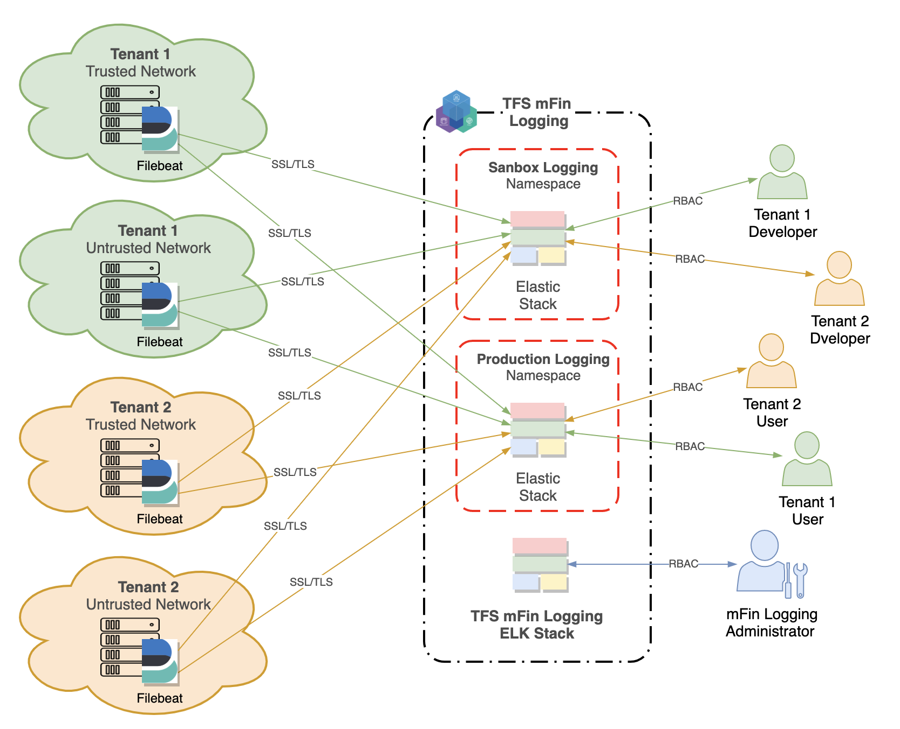

Figure 1: TFS mFin Logging Framework 

Two separate Elastic Stack  environments: Sandbox  and Production are deployed in two separate namespaces as shown in Figure 1. The Sandbox environment is used by developers for extensive testing of configurations prior to deploying them in production. Each environment has separate instance of Kibana for visualization and management of Elasticsearch data.

The Framework supports logging needs of systems and applications from trusted networks  (ESP, EDP, …) as well as from untrusted networks (MuleSoft, NICE, Salesforce, …). The initial MVP deployment focuses on collection of log data using Filebeat. Subsequent releases will include collection and correlation of operating data using other Data Shippers and APM.

The TFS Logging Framework captures log data from multiple tenants. Tenants are able to query and report on their log data in near real time. The Framework keeps each  tenant’s  information separate from each other throughout the complete Elastic Stack.

To segregate tenants’ information persisted in Elasticsearch, we define one index per tenant per time frame. We use, aliases to allow transparent changes to indexing time frames.

To secure the TFS Logging Cluster all internode communications are encrypted. The Elastic Stack security features cover encryption of  traffic to, from, and within the Elasticsearch cluster.

Figure 2 shows the TFS Logging Framework infrastructure architecture.

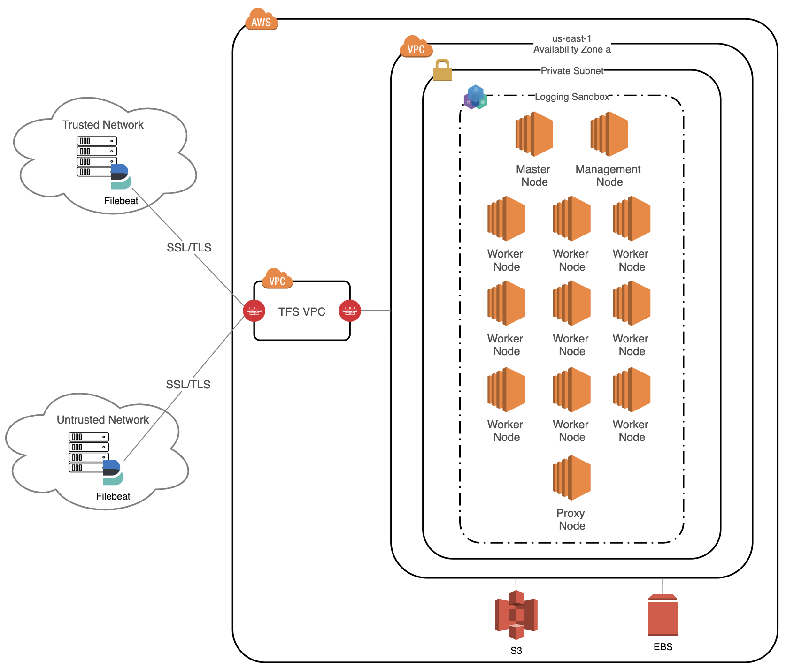

Figure 2: TFS mFin Logging Framework – Infrastructure Architecture

The nine-node sandbox environment shown above is deployed in one Availability Zone and can be scaled up to a production cluster distributed over three Availability Zones with three worker nodes in each.

The environment consists of the following technology components:
* Kibana – three nodes,
* Logstash – three nodes,
* Elasticsearch Ingest/Client – three nodes,
* Elasticsearch Master – three nodes,
* Elasticsearch Data – three nodes.

The following Kubernetes resource types are used for deployment of the above technology components: 

* Deployment for Kibana nodes (stateless)
* StatefulSet for Logstash nodes (stateful)
* Deployment for Elasticsearch Master nodes (stateless)
* Deployment for Elasticsearch Ingest/Client nodes (stateless)
* StatefulSet for Elasticsearch Data nodes (stateful)

To avoid an outage due to the loss of that individual machine, we need to preclude co-locating multiple instances of the resources on the same machine by deploying them in anti-affinity mode. 

# 2 TFS Logging Framework Backgroud Information

## 2.1 Background Information
TFS needs ability to reliably and securely collects log data from any source, in any format, and search, analyze, and visualize it in real time. 

The Logging Framework proposed in this document is based on the Elastic Stack (see References [1] - [3] for more information). The following section introduces a brief overview of the Elastic Stack architecture and its main components.

### 2.1.1 Elastic Stack Overview

The Elastic Stack – formerly known as the ELK (Elasticsearch, Logstash, and Kibana) Stack, now renamed to the Elastic Stack with the addition of Beats – is shown in Figure 3 below: 

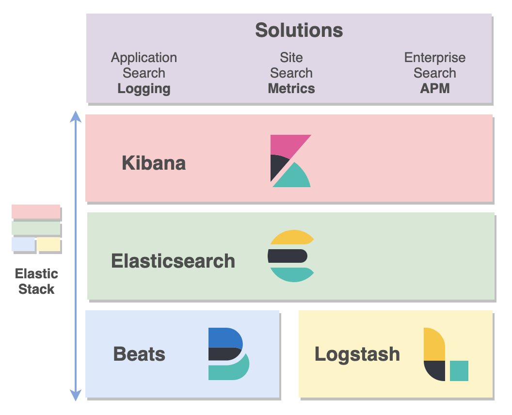

Figure 3: Elastic Stack

The main components of the stack include:

* Kibana: an open source data visualization plugin for Elasticsearch. It provides visualization capabilities on top of the content indexed on an Elasticsearch cluster. 
* Elasticsearch: a search engine based on the Lucene Java library. It provides a distributed, multitenant-capable full-text search engine with a web interface and schema-free JSON documents. 
* Beats: a collection of lightweight (resource efficient, no dependencies, small) and open source log shippers that act as agents installed on the different servers in infrastructure for collecting logs or metrics. 
* Logstash: handles the tasks of pulling and receiving the data from multiple systems, transforming it into a meaningful set of fields and eventually streaming the output to a defined destination for storage (Elasticsearch).

Taken together, the different components of the Elastic Stack provide a simple yet powerful solution for log management and analytics (see Figure 4): 

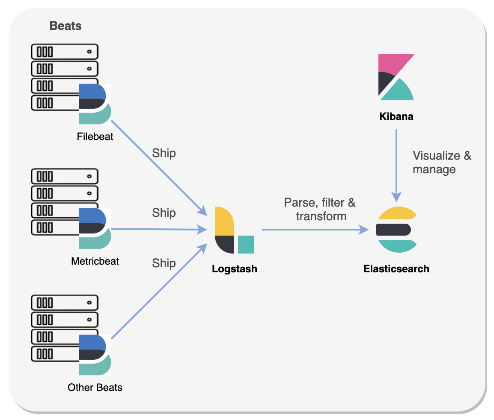

Figure 4: Elastic Stack – the High-Level Architecture

Logstash collects data from various input sources via Beats, executes different transformations and enhancements and then ships the data to Elasticsearch for full-text search and analysis. Kibana works on top of Elasticsearch, providing users with the ability to analyze and visualize the data.

The Elastic Application Performance Monitoring (APM) Server – introduced in Elastic Stack 6.6.0 – collects distributed workloads performance data and stores it into an Elasticsearch index. For more information about the Elastic APM, see Reference [4].

The Elastic APM data correlated with logs and metrics data collected via Logstash and Beats can be used for deployments of comprehensive operational analytics, including infrastructure and application logging and metrics, as well as deep APM transaction analysis (see Reference [5]).

The release of the TFS Logging Framework described in this document does not cover the Elastic APM deployment and integration with the other Elastic Stack components. Elastic APM features will be added in the future releases of the Framework.

The following sections provide more information about the Elastic Stack components, needed for understanding of the proposed TFS Logging Framework.

### 2.1.2 Beats

Beats are open source data shippers that can be installed as agents on edge servers to send operational data to Elasticsearch (see Reference [6]). Elastic provides Beats for capturing the growing number of log or matric data as shown in Table 1: Elastic Beats,

| Data Captured	  | Beat  |
|:---|:---:|
| Audit data	| Auditbeat |
| Log files	| Filebeat |
| Cloud data	| Functionbeat |
| Availability 	| Hartbeat |
| System journals	| Journalbeat |
| Metrics	| Metricbeat |
| Network traffic	| Packetbeat |
| Windows event logs	| Winlogbeat |

Beats can send data directly to Elasticsearch or via Logstash, where the data can be further processed and enhanced, before visualizing it in Kibana (see Figure 5).

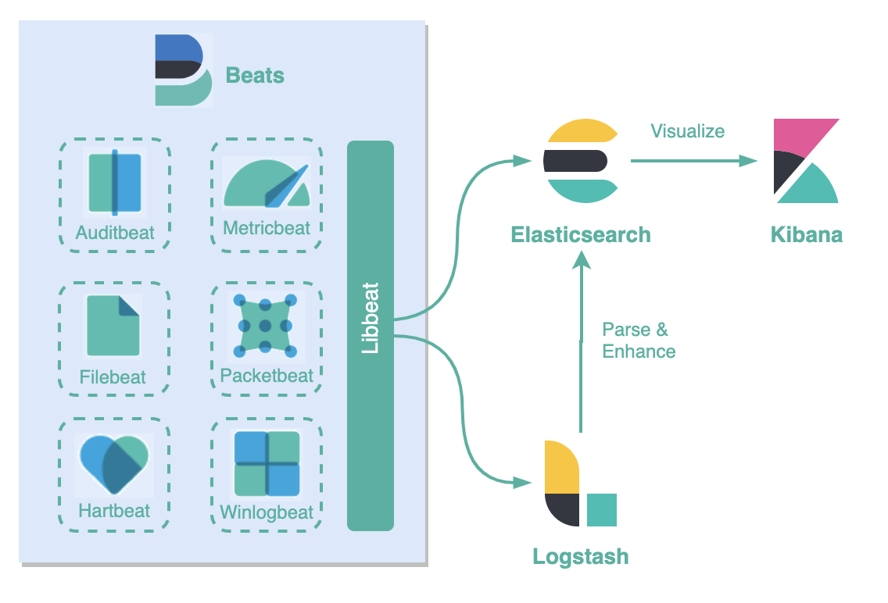

Figure 5: Elastic Beats

Beats are built on top of a Go framework called libbeat (see Reference [7] for more details) – a library for data forwarding which means that new beats are being developed and contributed by the community all the time. See Reference [8] for a list of available community Beats. 

The TFS Logging Framework proposed in this document utilizes Filebeat for sending log data for processing. The following section provides more Filebeat related information.

### 2.1.3 Filebeat

Filebeat is a lightweight shipper for forwarding and centralizing log data (see Reference [9]). Installed as an agent on edge servers, Filebeat monitors the log files or locations specified for log data, collects log events, and forwards them to either to Elasticsearch or Logstash for indexing.

When Filebeat starts, it initiates one or more inputs that look in the locations specified for log data (see Figure 6). For each log that Filebeat locates, Filebeat starts a harvester. Each harvester reads a single log for new content and sends the new log data to libbeat, which aggregates the events and sends the aggregated data to the output that you’ve configured for Filebeat.

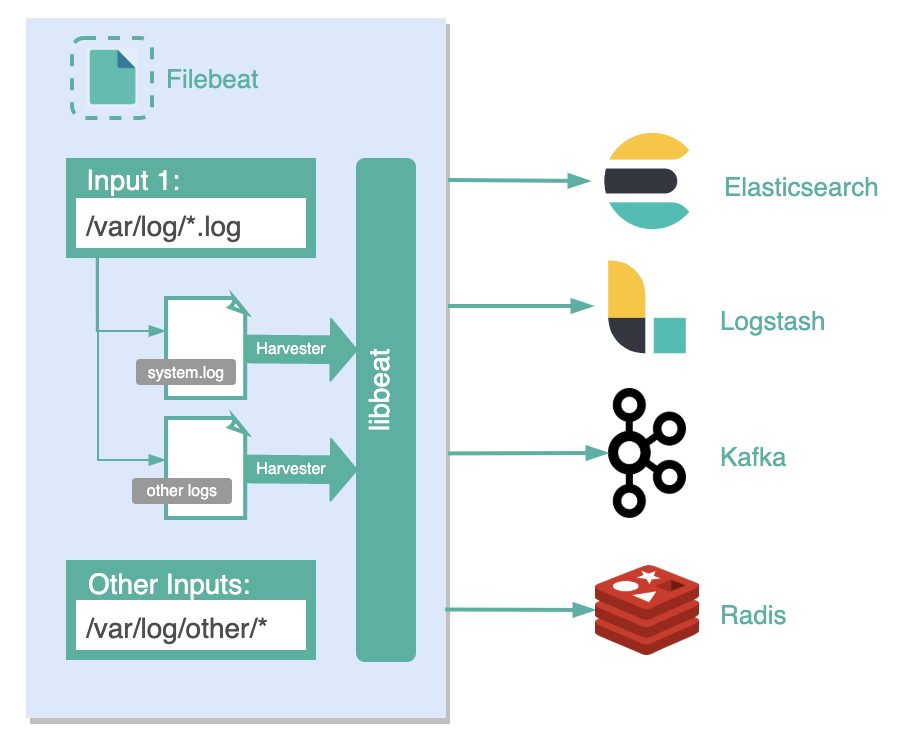

Figure 6: Filebeat Architecture

Filebeat is one of the best log file shippers out there today – it is lightweight, supports SSL and TLS encryption, supports back pressure with a good built-in recovery mechanism, and is extremely reliable. For more information how Filebeat works and how to install and configure it see Reference [9].

### 2.1.4 Filebeat vs. Logstash

Although, both Filebeat and Logstash can be used to send logs from a file-based data source to a supported output destination, the Framework proposed here is using both in tandem for building a logging pipeline with the Elastic Stack because both have a different function. Filebeat servers as an extractor of data and we still need Logstash to transform and aggregate data from multiple logging pipelines.

### 2.1.5 Logstash

Logstash is a plugin-based data collection and processing engine (see References [10] - [12]). It comes with a wide range of plugins that make it possible to easily configure it to collect, process and forward data in many different architectures. Processing is organized into one or more pipelines as shown in Figure 7.

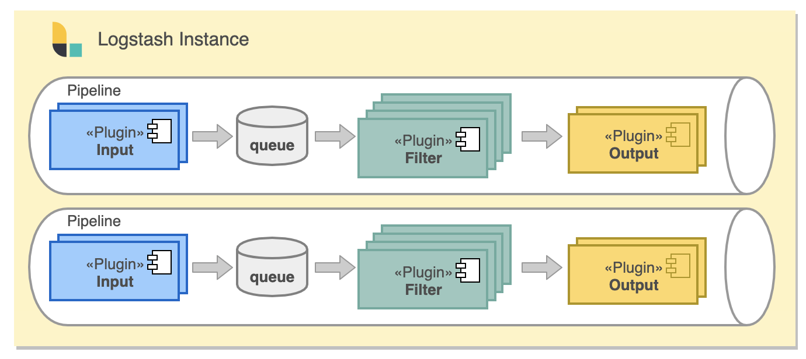

Figure 7: Logstash

In each pipeline, one or more input plugins receive or collect data that is then placed on an internal queue. The queue is by default small and held in memory, but can be configured to be larger and persisted on disk in order to improve reliability and resiliency. Some of the more commonly used inputs are file, syslog, redis, and beats. For more information about the available inputs, see Input Plugins section of Reference [10].  

Processing threads read data from the queue in micro-batches and process these through any configured filter plugins in sequence. Logstash out-of-the-box comes with a large number of plugins targeting specific types of processing, and this is how data is parsed, processed and enriched. For more information about the available filters, see Filter Plugins section of Reference [10].

Once the data has been processed, the processing threads send the data to the appropriate output plugins, which are responsible for formatting and sending data onwards, e.g. to Elasticsearch. For the list of currently available output plugins see Output Plugins section of Reference [10].

Input and output plugins can also have a codec plugin configured. This allows parsing and/or formatting of data before it is put onto the internal queue or sent to an output plugin. Popular codecs include json, msgpack, and plain (text).

Logstash has a simple configuration DSL for specifying the inputs, outputs, and filters described above, along with their specific options. Order matters, specifically around filters and outputs, as the configuration is basically converted into code and then executed. 

### 2.1.6 Logstash Implementation Best Practices

Logstash suffers from some inherent issues that are related to its design. Logstash requires JVM to run, and this dependency coupled with the implementation in Ruby became the root cause of significant memory consumption, especially when multiple pipelines and advanced filtering are involved (see Reference [13]).

Resource shortage, bad configuration, unnecessary use of plugins, changes in incoming logs – are potential sources of performance issues which can in turn result in data loss. 

Here is a list of some best practices that will help you avoid some of the common Logstash pitfalls:
* Add a buffer (queuing layer) between Logstash and the destination (see Figure 8). The most popular methods use Kafka, Redis and RabbitMQ. 
* Enable Persistent Queues to increase data resiliency by storing data in an internal queue on disk. 
* Enable Dead Letter Queues to persist events  that could not be processed on disk. 
* Keep Logstash configuration as simple as possible. Do not use plugins if there is no need to do so. 
* Test Logstash configuration in a sandbox environment prior to deploying it in production.

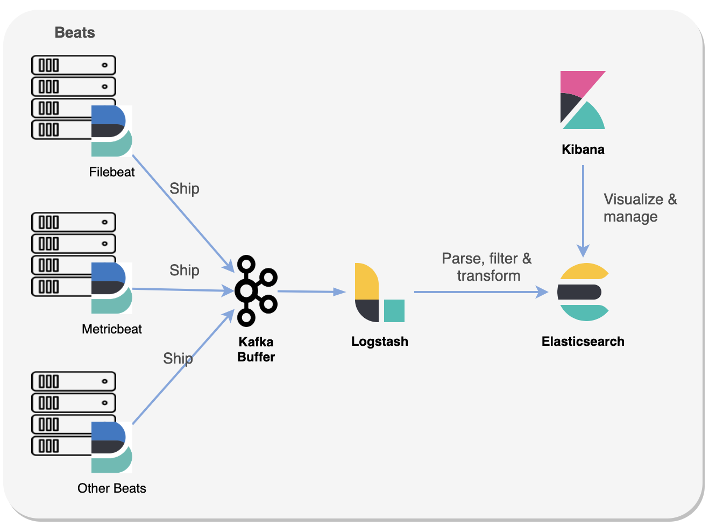

Figure 8: Logstash + Kafak Buffer

The TFS Logging Framework proposed in this document follows the above best practices.

### 2.1.7 Elasticsearch

Elasticsearch is the distributed search and analytics engine at the heart of the Elastic Stack. Elasticsearch is where the indexing, search, and analysis tasks are performed (see Reference [14] for more details).

Starting an instance of Elasticsearch, starts a node. All nodes know about all the other nodes in the cluster and can forward client requests to the appropriate node. A collection of connected nodes is forming a cluster as shown in Figure 9.

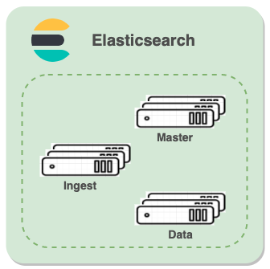

Figure 9: Elasticsearch Cluster

By default, a node is all of the following types: master-eligible, data, ingest, and machine learning (if used).
* Master-eligible node – a node that has *node.master* set to *true* (default), which makes it eligible to be elected as the master node, which controls the cluster.
* Data node – a node that has *node.data* set to *true* (default). Data nodes hold data and perform data related operations such as CRUD, search, and aggregations.
* Ingest node – a node that has *node.ingest* set to *true* (default). Ingest nodes are able to apply an ingest pipeline to a document in order to transform and enrich the document before indexing. With a heavy ingest load, it makes sense to use dedicated ingest nodes and to mark the master and data nodes as node.ingest: false.
* Machine learning node – a node that has *xpack.ml.enabled* and *node.ml* set to *true*, which is the default behavior in the Elasticsearch default distribution. This node is not part of the TFS Logging Framework. 

For more information about the Elasticsearch nodes see appropriate section in Reference [14].

### 2.1.8 Elasticsearch Configuration Best Practices

1. By default, a node is a master-eligible node and a data node, plus it can pre-process documents through ingest pipelines. This topology is convenient for small clusters – potentially a sandbox environment.
 Indexing and searching of data is CPU-, memory-, and I/O-intensive work which can put pressure on a node’s resources. To ensure that master node is stable and not under pressure, it is a good idea in a bigger production-like cluster to split the roles between dedicated master-eligible nodes and dedicated data nodes.
2.	Master nodes must have access to the <code>data/</code> directory (just like <data>data</data> nodes) as this is where the cluster state is persisted between node restarts.
3.	To be able to remain available when one of the master-eligible nodes fails, clusters should have at least three master-eligible nodes, with <code>minimum_master_nodes</code> set accordingly (see Reference [15]).
4.	To prevent data loss minimum_master_nodes setting should be set to a quorum of master-eligible nodes (see Reference [16]):

  <code>(master_eligible_nodes / 2) + 1</code> 
  
  In other words, if there are three master-eligible nodes, then minimum master nodes should be set to <code>(3 / 2) + 1</code> or <code>2</code>.
5.	Never run different node types (i.e. master, data) from the same data directory. This can lead to unexpected data loss.

For more information about the Elasticsearch nodes see the Reference [17].

### 2.1.9 Kibana

Kibana is a browser-based user interface that can be used to search, analyze and visualize the data stored in Elasticsearch indices (Kibana cannot be used in conjunction with other databases). 

Kibana can be installed on Linux, Windows and Mac using .zip or tar.gz, repositories or on Docker. Kibana runs on node.js, and the installation packages come built-in with the required binaries. Read more about setting up Kibana in References [19] and [20].

# 3 Deployment of TFS Logging Framework

## 3.1 TFS Logging Framework Architectural Considerations

The proposed TFS Logging Framework is based on the Elastic Stack shown in Figure 3. The following sections presents considerations that informed the architectural recommendations related to the deployment of the Framework.

### 3.1.1 Why Kubernetes?

Part of the core value of the Elastic Stack is its ability to search massive volumes of log data quickly. However, even the most optimized Elastic Stack code can perform only so well if the infrastructure on which it is running is limited in capacity. 

To address this concern, we propose deploying the Framework in Kubernetes environment. By doing so, the infrastructure available to Elastic Stack is virtually limitless due to Kubernetes dynamic scaling capabilities. 

### 3.1.2 Why Orchestrated Kubernetes?

While Kubernetes can dramatically simplify the task of deployment of Elastic Stack components in containers, dynamic nature of the environment adds new complexity to monitoring the services running in containers, as well as, the health of the containers and orchestration infrastructure itself. 

To address this concern, we propose deploying the Framework in IBM Cloud Private (ICP) environment. The ICP logging and monitoring capabilities – based on ELK Stack – are highly tuned and optimized for performance of orchestrated containers. The ICP management logging service can be used to finetune the environment for the TFS Framework Logging needs including:
* Memory allocation per pod 
* Minimum disk size
* TLS encryption
* Data retention policies
* Audit log collection
* Role-based authentication
* Access to Kibana through the ingress

See References [21] and [22] for more details about ICP logging and monitoring features.

### 3.1.3 Why not use ESP ICP for deployment of the TFS Logging Framework?

TFS currently has ICP deployed in support of ESP workloads and underlining technology components. By default, ICP uses an ELK stack for logging related to containers and deployed workloads under its orchestration. 

The TFS Logging Framework needs to support wide range of workloads (MuleSoft services, IVR services, …) distributed across multiple public and private clouds. Indexing and searching of data generated by these systems is CPU-, memory-, and I/O-intensive work which can put undue pressure on the EIP resources, if the Framework is deployed in the EIP ICP. 

To address this concern, we propose deploying the Framework in a separate ICP cluster dedicated, sized and configured for the specific needs of the TFS Logging Framework. 

### 3.1.4 Why do we need a sandbox environment?

Logstash is an essential part of an effective centralized logging system – it handles the tasks of pulling and receiving the data from multiple systems, transforming it into a meaningful set of fields and eventually streaming the output to a defined destination for storage (stashing). 

At the same time, Logstash is still considered as one of the main pain points in the stack. It suffers from some inherent issues that are related to its design. Resource shortage, bad configuration, unnecessary use of plugins, changes in incoming logs – all of these can result in performance issues which can in turn result in data loss. 

To address this concern, we propose deploying a sandbox environment to allow for extensive testing of Logstash configurations prior to deploying them in production. 

## 3.2 TFS Logging Framework

### 3.2.1 TFS Logging Framework Overview

Figure 10 depicts the proposed TFS Logging Framework:

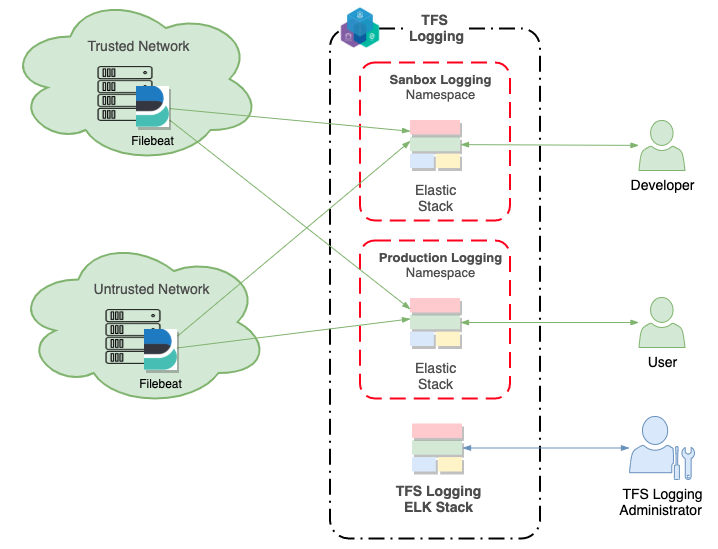

Figure 10: TFS Logging framework

The Framework supports logging needs of systems and applications from trusted networks  (ESP, EDP, …) as well as from untrusted networks (MuleSoft, NICE, Salesforce, …). The initial MVP deployment focuses on collection of log data using Filebeat. Subsequent releases will include collection and correlation of operating data using other Data Shippers and APM.

The Framework is deployed in the dedicated instance of ICP. The ICP default ELK Stack supports logging and monitoring nodes of the Framework itself. 

Two separate Elastic Stack  environments: Sandbox  and Production are deployed in two separate namespaces as shown in Figure 10. The Sandbox environment is used by developers for extensive testing of Logstash configurations prior to deploying them in production. Each environment has separate instance of Kibana for visualization and management of Elasticsearch data.

### 3.2.2 TFS Logging Framework Infrastructure Architecture

Figure 11 shows the TFS Logging Framework Sandbox infrastructure architecture.

Figure 11: TFS Logging Sandbox Infrastructure  Architecture

The following comments provide more details related to the architecture:
* The infrastructure is deployed in a single AZ and a single Region. 
* The Framework is deployed in a Kubernetes cluster (IBM Cloud Private - ICP).
* The cluster consists of nine <code>m5.large</code> EC2 instances being used as worker nodes.
* The EC2 instances use AWS Elastic Block Storage (EBS).
* The cluster is deployed in the existing EIP (ESP/EDP) VPC. 
* All the cluster nodes are protected within a private subnet. Security groups are used to control the network access to cluster nodes from inside and outside of the cluster.
* The infrastructure is instantiated through automation – using the existing EIP ICP Terraform code as the basis.
* he existing ICP Terraform build node is used for the infrastructure deployment.

The nine-node sandbox environment deployed in one Availability Zone can be scaled up to a production cluster distributed over three Availability Zones with three worker nodes in each.

### 3.2.3 Kubernetes Deployment of the Technology Components

The following sections introduces the deployment topologies and configurations for the TFS Logging environment technology components.
The environment consists of the following technology components:
* Kibana – three nodes,
* Logstash – three nodes,
* Elasticsearch Ingest/Client – three nodes,
* Elasticsearch Master – three nodes,
* Elasticsearch Data – three nodes.

The following Kubernetes resource types are used for deployment of the above technology components: 
* Deployment for Kibana nodes (stateless)
* StatefulSet for Logstash nodes (stateful)
* Deployment for Elasticsearch Master nodes (stateless)
* Deployment for Elasticsearch Ingest/Client nodes (stateless)
* StatefulSet for Elasticsearch Data nodes (stateful)

Electing a master node and changing the cluster state are the two fundamental tasks that master-eligible nodes must work together to perform. It is important that these activities work robustly even if some nodes have failed. Elasticsearch achieves this robustness by considering each action to have succeeded on receipt of responses from a quorum, which is a subset of the master-eligible nodes in the cluster.

For our specific setting of three master-eligible nodes, the minimum number of master nodes (<code>minimum_master_nodes</code>)is set to 2 to prevent potential data loss due to “split-brain” condition – see the best practices documented in Section 2.1.8.  This configuration ensures that the cluster remains available and operates correctly if one node fails. 

By default, Kubernetes may co-locate Master node pods in a <code>StatefulSet</code> on the same EC2 instance. The failure of that instance might result in simultaneous failure of multiple nodes which would render the cluster unavailable. To avoid an outage, due to the loss of that individual machine, we need to preclude co-locating multiple instances of the Master nodes on the same machine by deploying them in anti-affinity mode.

## 3.3 TFS Logging Framework mFin Considerations

The TFS Logging Framework needs to capture log data from multiple tenants. Tenants need be able to query and report on their log data in near real time. The Framework needs to keep each  tenant’s  information separate from each other throughout the complete Elastic Stack as shown in Figure 12:

Figure 12: TFS mFin Logging Framework

### 3.3.1 mFin Data Layout

Logging use cases are characterized by fast-growing number of documents in indices. Documents are almost never updated and searches mostly target the most recent documents. As documents age, they lose value.  With that in mind, we propose an index per time frame data layout approach for the TFS Logging Framework. 

To segregate tenants’ information persisted in Elasticsearch, we define one index per tenant per time frame (Figure 13 shows example of a daily time frame):

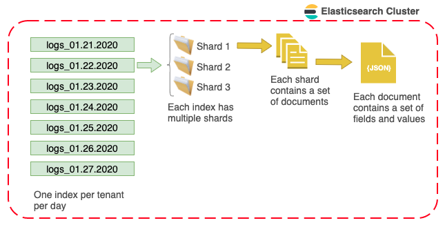

Figure 13: Layout of mFin Logging Framework Data in the Cluster

This approach has the advantage of allowing us to:
* Move tenants between Elasticsearch clusters if some tenants have large usage then others,
* Implement tenant specific retention policies – some may want to keep 7 days, some 14 days, worth of data,
* Enhance performance – the most recent indices are queried the most often with occasional use of the remaining others.

Furthermore, aliases can be used to make changes to indexing time frames transparent – see Reference [18] for more details.

### 3.3.2 mFin Capacity Planning

Determining the number of shards needed is not straight forward. The result depends on many variables: the hardware used, the size and complexity of documents, how are document indexed and searched, and more.

Therefore, we propose performing a single shard capacity test. Essentially, we want to replicate real-world usage and to push this single shard until it “breaks,” i.e., until the response time exceeds acceptable level. 

Once we  define the capacity of a single shard, it is easy to extrapolate the number of shards needed to process the whole index. Take the total amount of data that we need to index, plus some extra for future growth, and divide by the capacity of a single shard. The result is the number of primary shards that we  will need.

### 3.3.3 mFin Security and Access Control

To secure the TFS Logging Cluster we must ensure that the internode communications are encrypted. The Elastic Stack security features cover encryption of  traffic to, from, and within the Elasticsearch cluster. Connections are secured using Transport Layer Security (TLS) as documented in Reference [26].

Elasticsearch and Kibana do not come with any security features out of the box. We basically have three options:

* Using a reverse proxy like NGiNX (see References [27] and [28]),
* Use the (commercial) X-Pack from Elasticsearch (see References [29] and [30]),
* Use Search Guard, which comes in a free Community Edition and a commercial Enterprise Edition (see References [31] and [32]).

Using a proxy-based solution may seem fine at first glance, but we might not be able to secure the cluster properly, due to things like index aliases or bulk requests. Thus, data may leak between your tenants. 

The X-Pack installation instructions from Reference [30] are only valid for versions 6.2 and older. In versions 6.3 and later, X-Pack is included with the default distributions of Elastic Stack, with all free features enabled by default (see Reference [29]). An opt-in trial is available to enable subscription features (see Reference [2]). 

Search Guard provides security plugins for authentication, session management, and multi-tenancy for both Elasticsearch and Kibana (see References [33] and [34] for more details). 

**Note on Kibana multi-tenant implementation:** Kibana stores all so-called “Saved Objects”, like saved searches, visualizations and dashboards in one global index. Which means that all tenants see all visualizations and dashboards from all the other tenants as well. Even if most of these objects will be empty (because the tenant only has access to its own Elasticsearch index/data), this is unwanted behavior.  Search Guard provides a multi-tenancy enterprise module (Reference [33]) and a Kibana plugin that adds true separation of saved objects based on the logged in tenant (Reference [34]). At the time of writing, X-Pack does not have this feature.

All things considered; Search Guard plugins are recommended for the TFS Logging Framework. 

# References:

[1]	Elastic Stack: https://www.elastic.co/products/elastic-stack 

[2]	Elastic Stack Subscriptions: https://www.elastic.co/subscriptions 

[3]	Elastic Stack and Product Documentation: https://www.elastic.co/guide/index.html

[4]	Elastic APM: https://www.elastic.co/products/apm 

[5]	Logging, Metrics, and APM: The Operations Trifecta: https://www.elastic.co/elasticon/tour/2018/santa-clara/logging-metrics-and-apm-the-operations-trifecta

[6]	Beats: https://www.elastic.co/guide/en/beats/libbeat/current/index.html 

[7]	Libbeats: https://github.com/elastic/beats/tree/master/libbeat 

[8]	Community Beats: https://www.elastic.co/guide/en/beats/libbeat/current/community-beats.html 

[9]	Filebeat: https://www.elastic.co/guide/en/beats/filebeat/current/index.html 

[10]	Logstash Reference Documentation: https://www.elastic.co/guide/en/logstash/current/index.html 

[11]	Getting Started with Logstash: https://www.elastic.co/guide/en/logstash/7.3/getting-started-with-logstash.html 

[12]	Parsing Logs with Logstash: https://www.elastic.co/guide/en/logstash/7.3/advanced-pipeline.html 

[13]	Debugging Logstash Configuration File: https://logz.io/blog/debug-logstash/

[14]	Elasticsearch Reference Documentation: https://www.elastic.co/guide/en/elasticsearch/reference/current/index.html 

[15]	Quorum-based decision making: https://www.elastic.co/guide/en/elasticsearch/reference/master/modules-discovery-quorums.html 

[16]	Elasticsearch Avoiding Split Brain Problem: https://www.elastic.co/guide/en/elasticsearch/reference/6.3/modules-node.html#modules-node-xpack 

[17]	Elasticsearch Modules-Node: https://www.elastic.co/guide/en/elasticsearch/reference/7.3/modules-node.html

[18]	Time-Based Data: https://www.elastic.co/guide/en/elasticsearch/guide/current/time-based.html 

[19]	Kibana Reference Documentation: https://www.elastic.co/guide/en/kibana/current/index.html

[20]	Role-based access control: https://www.elastic.co/guide/en/kibana/current/development-security-rbac.html

[21]	ICP Logging: https://www.ibm.com/support/knowledgecenter/en/SSBS6K_3.1.0/manage_metrics/logging_elk.html 

[22]	ICP Cluster Monitoring: https://www.ibm.com/support/knowledgecenter/en/SSBS6K_3.1.0/manage_metrics/monitoring_service.html

[23]	Discovering the Need for an Indexing Strategy in Multi-Tenant Applications: https://www.elastic.co/blog/found-multi-tenancy 

[24]	Multi-tenancy in Elastic Search: https://stackoverflow.com/questions/41868056/multi-tenancy-in-elastic-search 

[25]	Multi-tenant logging with ELK: https://storyscript.io/blog/multi-tenant-logging-with-elk/ 

[26]	Setting up TLS on a cluster: https://www.elastic.co/guide/en/elastic-stack-overview/7.3/ssl-tls.html 

[27]	NGINX: http://nginx.org/ 

[28]	Securing the ELK Stack with Nginx: https://logz.io/blog/securing-elk-nginx/ 

[29]	We Opened X-Pack: https://www.elastic.co/what-is/open-x-pack 

[30]	Install X-Pack: https://www.elastic.co/downloads/x-pack 

[31]	Search Guard Main Concepts: https://docs.search-guard.com/latest/main-concepts 

[32]	Search Guard Installer: https://docs.search-guard.com/latest/demo-installer 

[33]	Securing Elasticsearch and Kibana with Search Guard for free: https://sematext.com/blog/elasticsearch-kibana-security-search-guard/ 

[34]	Kibana Multi-Tenancy with Search Guard: https://search-guard.com/kibana-multi-tenancy-search-guard/ 

[33]	Multi Tenancy: https://docs.search-guard.com/latest/kibana-multi-tenancy 

[34]	Installing the Search Guard Kibana Plugin: https://docs.search-guard.com/latest/kibana-plugin-installation 

[35]	Kibana role-based access control: https://www.elastic.co/guide/en/kibana/current/development-security-rbac.html

[36]	Set up Multi-Tenant Kibana Access in Open Distro for Elasticsearch: https://aws.amazon.com/blogs/opensource/multi-tenant-kibana-open-distro-for-elasticsearch/ 

[37]	Running Open Distro for Elasticsearch on Kubernetes: https://aws.amazon.com/blogs/opensource/open-distro-for-elasticsearch-on-kubernetes/

[38]	Running the Elastic Stack on Docker: https://www.elastic.co/guide/en/elastic-stack-get-started/master/get-started-docker.html 

[39]	Elastic Stack on Docker: https://github.com/deviantony/docker-elk 

